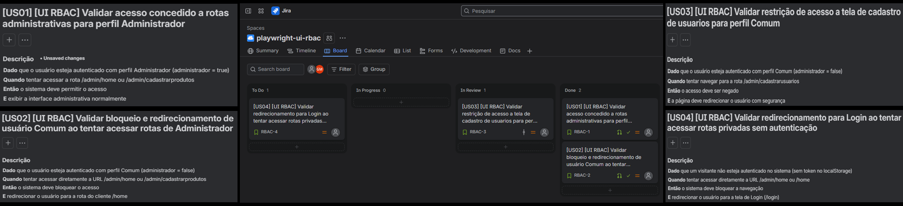

# Playwright UI RBAC - Controle de Acesso e Permissões

Projeto de automação de testes End-to-End (E2E) focado na validação de **Controle de Acesso Baseado em Perfis (RBAC - Role-Based Access Control)** na aplicação web **Serverest**, cobrindo matrizes de permissão para perfis Administrador, Usuário Comum e Visitante (Não Autenticado), integrado à gestão ágil do **Jira Software**.

## Objetivo

Garantir a integridade, o isolamento de rotas e o correto controle de segurança da interface gráfica do Serverest, assegurando que rotas administrativas sejam restritas a usuários autorizados e que tentativas de acesso indevido por usuários comuns ou visitantes sejam tratadas adequadamente.

## Tecnologias Utilizadas

- **Playwright** (v1.x)
- **Node.js**
- **JavaScript (ES6+)**
- **Jira Software** (Espaço `playwright-ui-rbac` / Chave `RBAC`)
- **Git / GitHub** (GitHub for Jira Integration)

## Gestão do Projeto e Rastreabilidade Ágil (Jira Software + GitHub)

O planejamento, especificação e ciclo de vida das tarefas foram gerenciados no **Jira Software** integrado ao **GitHub**:

- **Integração DevOps:** Conexão nativa do repositório GitHub ao Jira Software via aplicativo *GitHub for Jira*.
- **Rastreabilidade por Ticket:** Todas as branches e mensagens de commit possuem a chave da História de Usuário (ex: `RBAC-1`, `RBAC-2`, `RBAC-3`, `RBAC-4`), vinculando automaticamente o histórico de desenvolvimento aos cards no Jira.
- **Automação de Workflow (Jira Automation Rules):**
  - *Branch criada no Git* ➔ Ticket transita automaticamente para `In Progress`.
  - *Pull Request criado no GitHub* ➔ Ticket transita automaticamente para `In Review`.
  - *Pull Request mesclado na main* ➔ Ticket transita automaticamente para `Done`.

### Painel de Gestão no Jira Software & Especificações BDD (Gherkin)



## Matriz de Decisão e Permissões (RBAC)

| Perfil de Usuário | Rota / Funcionalidade Alvo | Resultado Esperado (Requisito) | Status da Aplicação (ServeRest) |
| :--- | :--- | :--- | :--- |
| **Administrador (`administrador: 'true'`)** | `/admin/home`, `/admin/cadastrarprodutos` | Acesso concedido com sucesso | ✅ Funcionando como esperado |
| **Usuário Comum (`administrador: 'false'`)** | `/admin/home` | Bloqueio / Redirecionamento para `/home` | 🐛 **Bug Identificado:** Acesso indevido permitido |
| **Usuário Comum (`administrador: 'false'`)** | `/admin/cadastrarusuarios` | Bloqueio / Redirecionamento para `/home` | 🐛 **Bug Identificado:** Acesso indevido permitido |
| **Visitante (Sem Autenticação / Guest)** | `/home`, `/admin/home` | Redirecionamento para `/login` | ✅ Funcionando como esperado |

## Cenários de Teste Automatizados (Histórias de Usuário)

| Ticket Jira | Cenário | Descrição Técnica & Asserções |
| :--- | :--- | :--- |
| **US01 / RBAC-1** | Validar acesso concedido a rotas administrativas para perfil Administrador | **Acesso Concedido.** Autentica via API com `administrador: 'true'`, injeta token no `localStorage` e valida navegação em `/admin/cadastrarprodutos`. |
| **US02 / RBAC-2** | Validar bloqueio de usuário Comum ao tentar acessar rotas de Administrador | **Asserção Negativa.** Autentica via API com `administrador: 'false'`, acessa `/admin/home` e valida com `expect(page).not.toHaveURL(...)`. Documenta falha de RBAC. |
| **US03 / RBAC-3** | Validar restrição de acesso a tela de cadastro de usuários para perfil Comum | **Asserção Negativa.** Autentica via API com `administrador: 'false'`, acessa `/admin/cadastrarusuarios` e valida com `expect(page).not.toHaveURL(...)`. Documenta falha de RBAC. |
| **US04 / RBAC-4** | Validar redirecionamento para Login ao tentar acessar rotas privadas sem autenticação | **Redirecionamento de Visitante.** Navega diretamente para `/home` e `/admin/home` sem token e valida redirecionamento para `https://front.serverest.dev/login`. |

## Destaques Técnicos e Arquitetura

- **Asserções Negativas Cirúrgicas (`.not.toHaveURL`):** Validação direta de restrição de segurança garantindo que o usuário comum jamais permaneça em rotas protegidas.
- **Bypass de Autenticação em Background (API):** Cadastro (`POST /usuarios`) e login (`POST /login`) silenciosos via API REST para isolar o escopo do teste.
- **Injeção de Sessão via `page.addInitScript()`:** Gravação direta do token JWT no `localStorage` do browser antes da renderização da página.
- **Massa de Dados Dinâmica Incremental:** Uso do `counter.json` para geração autônoma de usuários únicos a cada execução.
- **Desaceleração Visual Global (`slowMo`):** Configuração de `slowMo: 500` no `playwright.config.js` para acompanhamento visual das navegações no modo `--headed`.

## Estrutura do Projeto

```text
├── docs/
│   └── assets/
│       └── print-jira-details.png     # Painel de evidências do Jira & RBAC
├── tests/
│   └── rbac-validation.spec.js        # Suíte de testes E2E de Controle de Acesso e Permissões
├── counter.json                       # Persistência de contador incremental de massa
├── playwright.config.js               # Configurações globais do Playwright (slowMo, etc.)
├── package.json                       # Dependências e scripts do projeto
└── .gitignore                         # Arquivos ignorados pelo Git
```

## Pré-requisitos

- **Node.js** (versão 18 ou superior)
- **NPM**

## Como Executar os Testes

1. **Clonar o repositório:**
   ```bash
   git clone git@github.com:giovanemedeiros/playwright-ui-rbac.git
   cd playwright-ui-rbac
   ```

2. **Instalar as dependências:**
   ```bash
   npm install
   ```

3. **Executar a suíte de testes completa (Headless):**
   ```bash
   npx playwright test
   ```

4. **Executar em modo sequencial com interface gráfica (Headed):**
   ```bash
   npx playwright test tests/rbac-validation.spec.js --project=chromium --headed
   ```

5. **Gerar e abrir o relatório de testes (HTML Report):**
   ```bash
   npx playwright show-report
   ```
